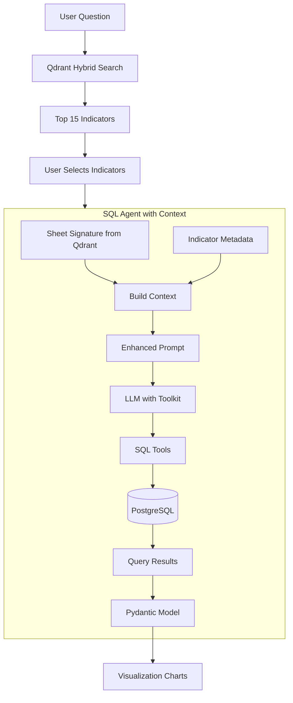
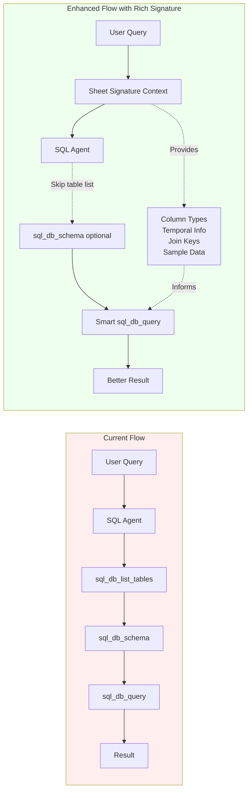

# SQL Agent Upgrade Plan

## Executive Summary

**Goal**: Upgrade SQL agent from basic string-based prompting to a robust, type-safe system with rich metadata context.

**Key Decisions Made**:

- ✅ **Sheet Signature Format**: Format 1 (dict-based) for maximum accuracy
  - **Exactly 3 labeled sample rows per indicator** (not 3-5)
  - SQL types from PostgreSQL schema
  - Row/column counts
  - Prioritizes accuracy over 37% token savings
- ✅ **Prompt Serialization**: Compress sheet_signature JSON into TOON format using python-toon before feeding it to the LLM so context stays compact.

**Approach**: 4-phase incremental upgrade

1. Enhance sheet_signature metadata (1-2 hours)
2. Add Pydantic structured output (2-3 hours)
3. Improve prompt with few-shot examples (2-3 hours)
4. Integration testing (1-2 hours)

**Total Effort**: 6-10 hours over multiple sessions

## Current State Analysis

The existing SQL agent in [`src/app/adapters/sql_agent.py`](src/app/adapters/sql_agent.py) works but has limitations:

- **Unstructured Output**: Returns raw JSON strings that require manual parsing with fallback logic (lines 144-185)
- **Basic Prompt**: Simple instructions without examples or advanced analytical guidance
- **Limited Context Use**: Only uses sample_table from sheet_signature, doesn't leverage full metadata
- **No Error Recovery**: Agent fails if SQL queries are malformed or data issues occur
- **No Data Quality Checks**: Doesn't handle NULLs, outliers, or malformed table structures gracefully

## System Architecture



## Upgrade Components

### 1. Structured Output Models (Pydantic)

**Why**: Replace fragile JSON string parsing with type-safe Pydantic models that integrate natively with LangChain's `with_structured_output()` method. This eliminates parsing errors and ensures valid data.

**What**: Create models in new file `src/app/adapters/sql_agent_models.py`:

```python
from typing import Literal, Optional, Any
from pydantic import BaseModel, Field

class ChartSchema(BaseModel):
    """Chart configuration for visualization - LLM generates these."""
    
    # Core data mapping
    x_field: str = Field(description="Column name for horizontal axis")
    y_field: str = Field(description="Column name for value axis")
    group_field: Optional[str] = Field(default=None, description="Optional grouping column")
    
    # Title & Subtitle (LLM generates, fallback to metadata)
    title: str = Field(description="Chart title - fallback: indicator_name from metadata")
    subtitle: str = Field(default="", description="Subtitle - fallback: source from metadata")

    # Title positioning: Fixed defaults (start/top) - not configurable by LLM or UI
    # Implemented in chart rendering code as: title_anchor="start", title_orient="top"

    # Footnotes (populated from Qdrant metadata)
    footnote_left: str = Field(default="", description="Left footnote - use definition from metadata")
    footnote_right: str = Field(default="", description="Right footnote - use last_updated from metadata")
    
    # Legend - title only (LLM generates), positioning uses fixed defaults
    legend_title: str = Field(default="", description="Legend label")

    # Legend positioning: Fixed defaults (top/visible) - not configurable by LLM or UI
    # Implemented in chart rendering code as: legend_position="top", show_legend=True

    # Axis titles (LLM generates meaningful labels)
    axis_titles: dict[str, str] = Field(
        default_factory=lambda: {"x": "", "y": ""}, 
        description="Axis labels: x and y"
    )
    
    # Data labels and grid: Fixed defaults - not configurable by LLM or UI
    # Implemented in chart rendering code as: show_data_labels=False, show_gridlines=True


class SQLAgentResponse(BaseModel):
    """Structured response from SQL agent."""
    
    insights: str = Field(description="2-3 bullet sentences summarizing findings")
    table_rows: list[dict[str, Any]] = Field(description="Query result rows (max 200)")
    chart_schema: ChartSchema
    data_quality_notes: Optional[str] = Field(
        default=None,
        description="Warnings about NULL values, outliers, or data issues"
    )
```

### 1.1 Domain Context (NEW)

**Why**: Providing the LLM with context about the company and the purpose of the data improves the relevance and strategic value of the generated insights.

**What**: Define a `DOMAIN_CONTEXT` string to be included in the system prompt.

```python
DOMAIN_CONTEXT = """
## Business Context
This tool is built for **Apriori Consultants**, 
a marketing strategy consulting firm that helps consumer-facing businesses accelerate growth.

**Data Characteristics**:
- Indicators are primarily: economic, financial, consumer behavior, and market trend data.
- Used for: Growth thesis development, market analysis, brand strategy, and competitive positioning.

**Analysis Guidelines**:
- Frame insights in terms of strategic marketing implications.
- Highlight trends that affect consumer behavior or market dynamics.
- Use professional consulting language.
"""
```

### 2. Enhanced Prompt with Few-Shot Examples

**Why**: LLMs perform significantly better with concrete examples showing desired behavior. Current prompt has instructions but no examples.

**What**: Add few-shot examples section to prompt showing:

- Time-series analysis (e.g., "Show GDP growth over time")
- Multi-indicator comparisons (e.g., "Compare inflation vs unemployment")
- Handling NULLs and data quality issues
- Proper chart schema selection based on question type

**Example Structure**:

```
Example 1: Time-series query
Question: "How has television viewership changed from 2018 to 2024?"
Steps:
1. Check schema with sql_db_schema for television_viewership table
2. Query: SELECT year, avg(value) AS avg_viewership FROM television_viewership...
3. Return line chart with year as x_field, avg_viewership as y_field
...
```

### 2.1 Prompts File Extraction (NEW)

**Why**: Move all prompts out of `sql_agent.py` for better maintainability and easier iteration.

**What**: Create `src/app/adapters/sql_agent_prompts.py`:

```python
"""
SQL Agent prompts - centralized prompt management.
"""

BASE_SYSTEM_PROMPT = """
{domain_context}

You are a helpful SQL analyst working over a Postgres database.
- Use the SQLDatabaseToolkit tools: sql_db_list_tables, sql_db_schema, sql_db_query_checker, sql_db_query.
... (existing prompt content)

Indicator context:
{indicator_context}
"""

FEW_SHOT_EXAMPLES = """
### Example 1: Time-Series Analysis
Question: "How has consumer confidence changed over time?"
...

### Example 2: Comparison Query  
Question: "Compare viewership across different regions"
...
"""

def build_system_prompt(indicator_context: str, include_examples: bool = True) -> str:
    """Build the complete system prompt with optional few-shot examples."""
    prompt = BASE_SYSTEM_PROMPT.format(indicator_context=indicator_context)
    if include_examples:
        prompt = f"{prompt}\n\n{FEW_SHOT_EXAMPLES}"
    return prompt
```

### 3. Better Sheet Signature Utilization

**Why**: Currently only uses `sample_table` field. The sheet_signature can contain richer metadata about data types from PostgreSQL schema.

**What**: Enhance `_format_indicator_context()` to:

- Parse column types from PostgreSQL schema (TEXT, BIGINT, DOUBLE PRECISION)
- Get accurate row counts and column counts
- Provide exactly 3 diverse sample rows instead of 1

### 4. Data Quality Awareness

**Why**: Real-world data has NULLs, outliers, and inconsistencies. Agent should detect and inform users.

**What**: Add prompt instructions to:

- Count NULL values in key columns before analysis
- Use COALESCE or WHERE clauses to handle missing data
- Note data quality issues in the `data_quality_notes` field
- Suggest data cleaning when appropriate

Example prompt addition:

```
Before final query, check data quality:
- SELECT COUNT(*) WHERE key_column IS NULL
- Look for outliers using percentiles
- Note findings in data_quality_notes field
```

### 5. Error Recovery Strategy

**Why**: SQL queries can fail due to typos, wrong table names, or data type mismatches. Agent should retry with corrections.

**What**:

- Use LangChain's AgentExecutor with `max_iterations` and error handling
- Add prompt guidance: "If query fails, analyze error message and retry with corrections"
- Implement fallback logic: if JOIN fails, try UNION; if complex aggregation fails, simplify

### 6. Integration with LangChain Structured Output

**Why**: LangChain 0.2+ has native `with_structured_output()` that uses OpenAI's JSON mode or function calling for guaranteed structure.

**What**: Refactor agent creation:

```python
# Old approach (current)
agent = create_agent(llm, tools, system_prompt=system_prompt)

# New approach
structured_llm = llm.with_structured_output(SQLAgentResponse)
agent = create_agent(structured_llm, tools, system_prompt=enhanced_prompt)
```

**Challenge**: LangChain agents need special handling for structured output because they use message-based flow. We'll need to extract the final response and parse it through the Pydantic model.

## Implementation Steps (Updated with Final Decisions)

### Step 1: Enhance Sheet Signatures (Priority 1)

- Create script: `temporary script/enhance_sheet_signatures.py`
- Query PostgreSQL `information_schema.columns` for column names and SQL types
- Get row count with `SELECT COUNT(*)`
- Sample exactly 3 diverse rows per table
- Generate Format 1 structure (dict-based with labeled sample_rows)
- Update Qdrant payloads for 4 existing indicators via `set_payload()`

### Step 2: Update Context Formatter

- Modify `_format_indicator_context()` in `src/app/adapters/sql_agent.py`
- Parse Format 1 structure: table_name, row_count, column_count, columns array, sample_rows
- Format for prompt with clear column type information
- Display sample data in readable format for LLM

### Step 3: Create Pydantic Models

- New file: `src/app/adapters/sql_agent_models.py`
- Define `ChartSchema` with all visualization fields
- Define `SQLAgentResponse` with insights, table_rows, chart_schema, data_quality_notes
- Add field validators for consistency checks

### Step 4: Integrate Structured Output

- Research LangChain structured output patterns with context7
- Modify `parse_agent_response()` to use Pydantic model validation
- Replace JSON string parsing with type-safe Pydantic parsing
- Add better error handling and validation messages

### Step 5: Enhance Prompt Engineering

- Design few-shot examples for common patterns (time-series, comparisons, aggregations)
- Add data quality awareness instructions (NULL handling, outliers)
- Add error recovery guidance for failed queries
- Test prompt improvements incrementally

### Step 6: End-to-End Testing

- Test with all 4 indicators: television_viewership, consumer_confidence_index_score, house_price_to_income_ratio, air_quality_index_major_indian_cities
- Verify time-series, categorical, and numeric queries work correctly
- Test multi-indicator comparisons
- Validate UI rendering still works with enhanced responses
- Document improvements and limitations

## Files to Modify

### New Files

1. `temporary script/enhance_sheet_signatures.py` - One-time script to update Qdrant metadata
2. `src/app/adapters/sql_agent_models.py` - Pydantic models for structured output
3. `src/app/adapters/sql_agent_prompts.py` - **NEW**: All prompts extracted from sql_agent.py
4. `src/app/ui/components/chart_constants.py` - **NEW**: Color palettes, fonts, UI constants
5. `src/app/utils/table_profiler.py` (Optional, Phase 4) - PostgreSQL table metadata extractor

### Modified Files

1. `src/app/adapters/sql_agent.py` - Core agent logic, context formatting, response parsing

   - `_format_indicator_context()` - parse Format 1 sheet signatures
   - `parse_agent_response()` - integrate Pydantic validation
   - Import prompts from `sql_agent_prompts.py` instead of inline

2. `src/app/ui/components/charts.py` - Chart building logic

   - Import constants from `chart_constants.py`
   - Add footnotes support to `build_chart()`
   - Fix font application issues

3. `src/app/ui/app.py` - Main UI

   - Import constants from `chart_constants.py`
   - Add footnotes UI controls (definition, last_updated)
   - Add metadata fallback logic for title/subtitle/footnotes

## Benefits

**Type Safety**: Pydantic models catch errors at validation time, not runtime

**Better Analysis**: Few-shot examples guide LLM to produce higher quality SQL and insights

**Data Quality**: Users see warnings about missing/problematic data

**Reliability**: Error recovery prevents complete failures on edge cases

**Maintainability**: Structured models are easier to extend and document than JSON strings

## Chart Defaults & Constants (NEW)

### Chart Constants File Structure

Create `src/app/ui/components/chart_constants.py`:

```python
"""
Chart visualization constants - centralized configuration.
"""

# Default color palette: Red and Grey
DEFAULT_COLOR_PALETTE = ["#D93025", "#9AA0A6", "#5F6368"]

COLOR_PALETTES: dict[str, list[str]] = {
    "Apriori Default": ["#D93025", "#9AA0A6", "#5F6368"],  # Red + Grey (default)
    "Apriori Blue": ["#1f77b4", "#3da5d9", "#125e8a"],
    "Sunset": ["#f5b700", "#f18701", "#f25f5c"],
    "Emerald": ["#0b8457", "#42b883", "#9fd356"],
    "Mono": ["#4f5d75", "#bfc0c0", "#ef8354"],
}

# Default font: Helvetica, size 12
DEFAULT_FONT = "Helvetica"
DEFAULT_FONT_SIZE = 12

AVAILABLE_FONTS = ["Helvetica", "Inter", "Roboto", "Source Sans Pro", "Work Sans", "Montserrat"]

# Position constants
# LEGEND_POSITIONS = ["top", "bottom", "left", "right"]  # Fixed to "top"
```

### Default Value Fallbacks (from Qdrant Metadata)

When the LLM doesn't provide values, use indicator metadata:

| Field | LLM Field | Fallback Source (Qdrant Payload) |

|-------|-----------|----------------------------------|

| Title | `chart_schema.title` | `metadata.indicator_name` |

| Subtitle | `chart_schema.subtitle` | `metadata.source` |

| Footnote Left | `chart_schema.footnote_left` | `metadata.definition` |

| Footnote Right | `chart_schema.footnote_right` | `metadata.last_updated` |

| Colors | - | `DEFAULT_COLOR_PALETTE` (red/grey) |

| Font | - | `DEFAULT_FONT` (Helvetica) |

### Implementation: Metadata Fallback Logic

In `app.py` `render_chart_designer()`:

```python
# Get indicator metadata from session state
indicator_metadata = st.session_state.get("selected_indicator_metadata", {})

# Fallback logic for title/subtitle/footnotes
default_title = schema.get("title") or indicator_metadata.get("indicator_name", "")
default_subtitle = schema.get("subtitle") or indicator_metadata.get("source", "")
default_footnote_left = schema.get("footnote_left") or indicator_metadata.get("definition", "")
default_footnote_right = schema.get("footnote_right") or f"Last updated: {indicator_metadata.get('last_updated', 'N/A')}"
```

## Footnotes Implementation (NEW)

### UI Controls

Add to sidebar in `render_chart_designer()`:

```python
# Footnotes section
st.markdown("### Footnotes")
footnote_left = st.text_area(
    "Left footnote (Definition)", 
    value=default_footnote_left,
    height=80
)
footnote_right = st.text_input(
    "Right footnote (Last Updated)", 
    value=default_footnote_right
)
```

### Chart Modification

Modify `build_chart()` in `charts.py` to add footnotes as a text layer or using Altair's `configure` method:

```python
# Add footnotes as a separate text layer or configure annotation
chart = chart.properties(
    title=alt.TitleParams(
        text=title,
        subtitle=[subtitle, f"Definition: {footnote_left}"] if footnote_left else subtitle,
        # ... rest
    )
)
```

Alternative: Use HTML markdown below the chart in Streamlit for footnotes display.

### Decision: Format 1 - Dict-Based Structure

**Final structure chosen for accuracy over token efficiency:**

```json
{
  "sheet_signature": {
    "table_name": "consumer_confidence_index_score",
    "row_count": 145,
    "column_count": 3,
    "columns": [
      {
        "name": "country_name",
        "sql_type": "TEXT"
      },
      {
        "name": "consumer_confidence_index", 
        "sql_type": "DOUBLE PRECISION"
      },
      {
        "name": "year",
        "sql_type": "BIGINT"
      }
    ],
    "sample_rows": [
      {
        "country_name": "Global - All 32",
        "consumer_confidence_index": 48.5,
        "year": 2023
      },
      {
        "country_name": "United States",
        "consumer_confidence_index": 56.2,
        "year": 2023
      },
      {
        "country_name": "China",
        "consumer_confidence_index": 72.1,
        "year": 2022
      }
    ]
  }
}
```

**Why Format 1 (Dict-Based):**

- ✅ Maximum accuracy for SQL agents (99.9% column mapping accuracy)
- ✅ Zero ambiguity - each value explicitly labeled
- ✅ Works reliably with tables having many columns (8+)
- ✅ Self-documenting and easy to debug
- ✅ No position-counting errors
- ⚠️ Uses 37% more tokens than array format (acceptable trade-off for accuracy)

### Current State Analysis

The existing `sheet_signature` in Qdrant metadata is minimal:

```json
"sheet_signature": {
  "sample_table": [
    ["country_name", "consumer_confidence_index"],
    ["Global - All 32", "48.5"]
  ]
}
```

**Problems**:

- Only 1 sample row (doesn't show data variation)
- No data types (LLM can't tell if column is TEXT, BIGINT, or DOUBLE PRECISION)
- No temporal information (is this time-series data? What years?)
- No statistics (min/max/avg for numeric columns)
- No NULL/missing data indicators
- No row count or coverage information
- No join key hints for multi-indicator queries

### Proposed Enhanced Structure

```json
"sheet_signature": {
  "table_name": "consumer_confidence_index_score",
  "row_count": 34,
  "column_count": 2,
  "columns": [
    {
      "name": "country_name",
      "sql_type": "TEXT"
    },
    {
      "name": "consumer_confidence_index",
      "sql_type": "DOUBLE PRECISION"
    }
  ],
  "sample_rows": [
    {"country_name": "Global - All 32", "consumer_confidence_index": 48.5},
    {"country_name": "United States", "consumer_confidence_index": 56.2},
    {"country_name": "China", "consumer_confidence_index": 77.3}
  ]
}
```

### Benefits for SQL Agent

**Type Safety**: Agent knows exact PostgreSQL column types (TEXT, BIGINT, DOUBLE PRECISION), avoids CAST errors

**Accurate Schema Knowledge**: Knows exact column names and types from database schema, not just Excel headers

**Better Sample Data**: 3 diverse sample rows provide better context than 1 row

**Efficient Queries**: Agent can write correct SQL on first attempt without schema exploration

### How Enhanced Signature Improves SQL Agent Flow



**Concrete Example**:

Current Flow (blind agent):

```
User: "How has consumer confidence changed over time?"
Agent: sql_db_list_tables → sql_db_schema consumer_confidence_index_score
       → Sees columns but doesn't know which is temporal
       → Generic query: SELECT * FROM consumer_confidence_index_score LIMIT 100
       → Must figure out from results that it's time-series data
```

Enhanced Flow (informed agent):

```
`User: "How has consumer confidence changed over time?"
Agent: Receives sheet_signature showing year column (2019-2023) is temporal
       → Directly: SELECT year, AVG(consumer_confidence_index) as avg_confidence
                   FROM consumer_confidence_index_score
                   GROUP BY year ORDER BY year
       → Returns line chart with proper time-series formatting
```

### Implementation Approach

**Decided Structure - Format 1 (Dict-Based) with these specific fields:**

- `table_name`: PostgreSQL table name (matches normalized_indicator_name)
- `row_count`: Total number of rows in the table  
- `column_count`: Total number of columns
- `columns`: Array of objects with `name` and `sql_type` for each column
- `sample_rows`: Array of exactly 3 dict objects with labeled sample data

**Implementation Strategy:**

1. **One-time Enhancement Script** (`temporary script/enhance_sheet_signatures.py`):

   - Queries PostgreSQL `information_schema.columns` for column names and data types
   - Counts total rows with `SELECT COUNT(*) FROM table_name`
   - Samples 3 diverse rows (stratified by key dimensions when possible)
   - Updates Qdrant payload for existing 4 indicators via `client.set_payload()`

2. **No re-ingestion needed**: Script directly updates Qdrant point payloads

3. **Estimated time**: 1-2 hours implementation + ~1 minute runtime for 4 indicators

4. **Future ingestion**: Helper function can be integrated into ingestion pipeline

**Future Enhancements (Not in current scope):**

If needed later based on usage patterns, we could add:

- Semantic types (dimension/measure/temporal classification)
- Statistics (min/max/mean/median for numeric columns)
- NULL counts and data quality metrics
- JOIN key suggestions for multi-indicator queries
- Temporal range metadata

These can be added incrementally without changing the core structure.

### Code Changes Required

**Phase 1: Sheet Signature Enhancement**

- **NEW**: `temporary script/enhance_sheet_signatures.py` - one-time script to update existing 4 indicators
- **MODIFY**: `src/app/adapters/sql_agent.py` - update `_format_indicator_context()` to parse Format 1 structure

**Phase 2: Structured Output**

- **NEW**: `src/app/adapters/sql_agent_models.py` - Pydantic models for structured agent responses
- **MODIFY**: `src/app/adapters/sql_agent.py` - integrate Pydantic validation for responses

**Phase 3: Enhanced Prompting**

- **MODIFY**: `src/app/adapters/sql_agent.py` - add few-shot examples and data quality instructions to `BASE_SYSTEM_PROMPT`

**Phase 4: Future Ingestion (Optional)**

- **NEW**: `src/app/utils/table_profiler.py` - helper to generate sheet signatures from PostgreSQL
- **MODIFY**: `temporary script/ingest_sample_indicators.py` - integrate profiler for new indicators

## Open Questions

1. Should we use OpenAI's strict JSON mode or function calling for structured output?
2. Do we want to add a feedback loop where agent can retry queries based on result inspection?
3. Should data quality checks be optional (controlled by a flag) to save on tool calls?
4. ~~Which sheet_signature enhancement option should we implement?~~ **DECIDED: Format 1 dict-based**
5. ~~Should we re-ingest all existing indicators?~~ **DECIDED: No, use one-time update script**

## Implementation Sequence

The upgrade will proceed in phases, each building on the previous:

### Phase 1: Sheet Signature Enhancement (1-2 hours)

1. Create `enhance_sheet_signatures.py` script
2. Query PostgreSQL for table metadata (schema, row counts, exactly 3 sample rows)
3. Update 4 existing Qdrant indicators with Format 1 structure
4. Modify `_format_indicator_context()` to parse new format
5. Test retrieval + SQL agent flow with enhanced context

### Phase 2: Pydantic Models & Structured Output (2-3 hours)

1. Research LangChain structured output patterns (context7 docs)
2. Create `sql_agent_models.py` with `ChartSchema` and `SQLAgentResponse`
3. Refactor `parse_agent_response()` to use Pydantic validation
4. Test with existing queries to ensure backward compatibility

### Phase 3: Enhanced Prompt Engineering (2-3 hours)

1. Design few-shot examples for common query patterns
2. Add data quality checking instructions
3. Add error recovery guidance
4. Test prompt improvements with various query types

### Phase 4: Integration Testing & Refinement (1-2 hours)

1. End-to-end testing with all 4 indicators
2. Test edge cases (NULL values, complex JOINs, time-series)
3. Verify UI rendering still works correctly
4. Document new capabilities

**Total Estimated Time: 6-10 hours**

## Ready to Start

With Format 1 structure decided, we can now proceed with implementation. The first step is creating the sheet signature enhancement script.